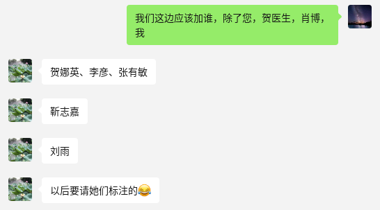

# PDCADxFoundation
# Challenge overview


# Challenge background


# Challenge tasks
## segmentation
This competition aim to promote the study of Parkinson's Disease, images

**This competition aim to promote the study of Parkinson's Disease, images**

*This competition aim to promote the study of Parkinson's Disease, images*

**This competition aim to promote the study of Parkinson's Disease, images**


~~asdf~~


## PD classification


```python
def hello():
    print("Markdown!")
```

| 左对齐 | 居中对齐 | 右对齐 |
|:-------|:-------:|-------:|
| 单元格 | 单元格  | 单元格 |

> 引用内容  
> 多行引用

---
或 *** （分割线）


- [x] 完成作业
- [ ] 写报告


<details>
<summary>点击展开</summary>
隐藏内容...
</details>


# evaluation codes
## segmentation

## PD classification

---
layout: default \
title: About
---
# About page

This page tells you a little bit about me.


The background color is `#ffffff` for light mode and `#000000` for dark mode.


About Us

Welcome to the Foundation-Model-Driven Parkinson's Disease Auto Diagnosis Challenge (PDCADxFoundation)!  

The PDCADxFoundation Challenge is a part of the 28th International Conference on Medical Image Computing 
and Computer Assisted Intervention, MICCAI 2025, which will be held from October 6th to 10th 2024 in Marrakesh, Morocco.

Motivation

The objective of establishing the CMRxUniversalRecon challenge (Toward Universal Reconstruction) is to provide a benchmark that enables the broader research community to contribute to the important work of accelerated CMR imaging with universal approaches that allow more diverse applications and better performance in real-world deployment in various environments.

Background

Cardiac magnetic resonance imaging (CMR) has emerged as a crucial imaging technique for diagnosing cardiac diseases, thanks to its excellent soft tissue contrast and non-invasive nature. However, a notable limitation of MRI is its slow imaging speed, which causes patient discomfort and introduces motion artifacts into the images. 

To accelerate image acquisition, CMR image reconstruction (recovering high-quality clinical interpretable images from highly under-sampled k-space data) has gained significant attention in recent years. Particularly, AI-based image reconstruction algorithms have shown great potential in improving imaging performance by utilizing highly under-sampled data. Currently, the field of CMR reconstruction lacks publicly available, standardized, and high-quality datasets for the development and assessment for AI-based CMR reconstruction. In the first run of the 'CMRxRecon' challenge (MICCAI 2023), we have provided cine and mapping data from a total of 300 subjects and the technical infrastructure as well as a baseline model for CMR reconstructions. The results of 'CMRxRecon' 2023 demonstrated that deep learning methods demonstrated significantly superior performance compared to traditional methods such as SENSE and GRAPPA in a single task scenario.

As we all know, CMR imaging has the nature of multi-contrast, e.g., cardiac cine, mapping, tagging, phase-contrast, and dark-blood imaging. It also includes imaging of different anatomical views such as long-axis (2-chamber, 3-chamber, and 4-chamber), short-axis, outflow tract, and aortic (cross-sectional and sagittal views). Additionally, accelerated imaging trajectories, including uniformly undersampling and variable-density sampling, are employed. Unfortunately, conventional CNN-based reconstruction models often require training and deployment for each specific imaging scenario (imaging sequence, view, and device vendor), limiting their clinical application in the real world.

Thus, in this second run of the CMR reconstruction challenge we aim to make an important step towards clinical implementation by extending the challenge scope in two directions:

1)Trustworthy reconstruction on multi-contrast CMR imaging (two will be unseen in the training dataset) using a universal pre-trained reconstruction model;

2)Robust reconstruction with diverse k-space trajectory and various acceleration factors using a universal model.

Challenge tasks

The CMRxRecon2024 challenge includes two independent tasks. Each team can choose to participate one of them or both: 

TASK 1: Multi-contrast CMR reconstruction


1) Goal: To develop a contrast-universal model that can 1) provide high-quality image reconstruction for highly-accelerated uniform undersampling (acceleration factors are 4x, 8x and 10x, ACS not included for calculations); 2) being able to process multiple contrast reconstructions with different sequences, views, and scanning protocols using a single universal model. The proposed method is supposed to offer a unified framework that can handle various imaging contrasts, allowing for faster and more robust reconstructions across different CMR protocols.

2) Note: In TASK 1, participants are allowed to train three individual contrast-universal models to respectively reconstruct multi-contrast data at the aforementioned three acceleration factors; TrainingSet includes Cine, Aorta, Mapping, and Tagging; ValidationSet and TestSet include Cine, Aorta, Mapping, Tagging, and other two unseen contrasts (Flow2d and BlackBlood); the data size of Cine, Aorta, Mapping, Tagging, and Flow2d is 5D (nx,ny,nc,nz,nt); the data size of BlackBlood is 4D (nx,ny,nc,nz); the size of all undersampling masks is 2D (nx,ny), the central 16 lines (ny) are always fully sampled to be used as autocalibration signals (ACS).

TASK 2: Random sampling CMR reconstruction


1) Goal: To develop a sampling-universal model that can robustly reconstruct CMR images 1) from different k-space trajectories (uniform, Guassian, and pseudo radial undersampling with temporal/parametric interleaving); 2) at different acceleration factors (acceleration factors from 4x to 24x, ACS not included for calculations). The proposed method is supposed to leverage deep learning algorithms to exploit the potential of random sampling, enabling faster acquisition times while maintaining high-quality image reconstructions.

2) Note: In TASK 2, participants are allowed to train only one universal model to reconstruct various data at the different undersampling scenarios (including different k-space trajectories: uniform, Guassian, and pseudo radial undersampling with temporal/parametric interleaving; and different acceleration factors: 4x, 8x, 12x, 16x, 20x, 24x, ACS not included for calculations); TrainingSet includes Cine, Aorta, Mapping, and Tagging; ValidationSet and TestSet also include Cine, Aorta, Mapping, and Tagging; the data size of Cine, Aorta, Mapping, and Tagging is 5D (nx,ny,nc,nz,nt); the size of all undersampling masks is 3D (nx,ny,nt), the central 16 lines (ny, in ktUniform and ktGaussian) or central 16x16 regions (nx*ny, in ktRadial) are always fully sampled to be used as autocalibration signals (ACS).

Awards

We will provide monetary awards for the top 5 winners of each task. The prize pool is exclusively sponsored by Philips.

Task 1: Multi-contrast CMR reconstruction

Task 	Winner 	Monetary Awards 	Certificate 	Oral Presentation 	Summary Paper Involved
Task 1 	Top 1 	$1,000 			
Task 1 	Top 2 	$500 			
Task 1 	Top 3 	$300 			
Task 1 	Top 4 	$200 			
Task 1 	Top 5 	$100 			

Task 2: Random sampling CMR reconstruction

Task 	Winner 	Monetary Awards 	Certificate 	Oral Presentation 	Summary Paper Involved
Task 2 	Top 1 	$1,000 			
Task 2 	Top 2 	$500 			
Task 2 	Top 3 	$300 			
Task 2 	Top 4 	$200 			
Task 2 	Top 5 	$100 			


All submissions will be reported in the leaderboard. Each participating team can participate in both tasks. However, we only present the higher reward among the two tasks to each team.

Prize-winning methods will be announced publicly as part of a scientific session at the MICCAI annual meeting.

Study Cohort

A total of 330 healthy volunteers are recruited for multi-contrast CMR imaging in our imaging center. The dataset include multi-contrast k-space data, consist of cardiac cine, T1/T2mapping, tagging, phase-contrast (i.e., flow2d), and dark-blood imaging. It also includes imaging of different anatomical views like long-axis (2-chamber, 3-chamber, and 4-chamber), short-axis (SAX), left ventricul outflow tract (LVOT), and aorta (transversal and sagittal views).
The released dataset includes 200 training data, 60 validation data and 70 test data.

Training cases including fully sampled k-space data will be provided in '.mat' format.

Validation cases include under-sampled k-space data, sampling trajectories, and autocalibration signals (ACS, 16 lines or 16x16 regions) with various acceleration factors in '.mat' format.

Test cases include fully sampled k-space data, undersampled k-space data, sampling trajectories, and autocalibration signals (ACS, 16 lines or 16x16 regions). Test cases will not be released before the challenge ends.


CMR acquisition design

1) Scanner:   Siemens 3T MRI scanner (MAGNETOM Vida)

2) Image acquisition: We follow the recommendations of CMR exams reported in the previous publication (doi: 10.1007/s43657-02100018x, 10.1007/s43657-021-00018-x).

3) Dataset overview: The dataset will include multi-contrast k-space data, consisting of cardiac cine, T1/T2 mapping, tagging, phase-contrast (i.e., flow2d), and dark-blood imaging. It also includes imaging of different anatomical views like long-axis (LAX, including 2-chamber, 3-chamber, and 4-chamber), short-axis (SAX), left ventricul aroutflow tract (LVOT), and aortic (transversal and sagittal views).

4) Scan protocol: We use 'TrueFISP' sequence for cine, phase-constrast (i.e., flow2d), and tagging, and 'FLASH' sequence for T1/T2 mapping and dark-blood imaging. For T1/T2 mapping, signals are collected at the end of the diastole with ECG triggering. Typically, 5~15 slices are acquired for each contrast. The cardiac cycle is segmented into 12~25 phases with a temporal resolution of around 50 ms. Typical geometrical parameters include: spatial resolution 1.5×1.5 mm2, slice thickness 8.0 mm, and slice gap 4.0 mm.

5) Pre-processing:The raw k-space data exported from the scanner will be processed and transformed to '.mat' format using the script provided by our vendor. A readme file will be provided to describe the content and usage of the data.

Principal of participation


Note: Participants are not required to upload the complete training code. But teams willing to upload the original training code will be automatically entered into the code-sharing pool.
Timeline

The schedule of the challenge is as follows. All deadlines are Pacific Standard Time (PST +0:00).

20 - Apr 	Website opens for registration
26 - Apr 	Release training and validation data
10 - May 	Submission system opens for validation
24 - Jun 	Deadline for conference paper placeholder submission
01 - Aug 	Submission system opens for testing
15 - Aug 	Deadline for conference paper submission
10 - Sept 	Docker submission (test phase) deadline
10 - Oct 	Release final results
10 - Nov 	Proceeding ready paper release 


